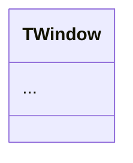

# Deep Code Analysis Skill

This skill allows you to analyze code repositories exhaustively, generating a complete understanding of the project similar to what DeepWiki offers. The analysis includes structure, architecture, technologies, patterns, and code quality.

It operates in **three modes**: contextual RAG analysis, multi-turn Deep Research, and direct Simple Chat — each with specific behaviors and focus levels suited to different investigation needs.

---

## When to Use This Skill

- When you need to understand an unknown codebase
- To perform technical due diligence on projects
- When documenting existing software architectures
- To identify technical debt and improvement opportunities
- When evaluating the overall quality of a project
- To generate automatic code documentation
- For deep, focused investigation of a specific functionality
- For technical audit of a specific file or module
- For iterative evaluation of an implementation
- To generate a consolidated technical conclusion

---

## Inputs

| Parameter | Type | Required | Description |
|---|---|---|---|
| `repo_path` | string | **yes** | Local path or URL of the repository to analyze |
| `repo_name` | string | **yes** | Name of the repository |
| `user_query` | string | **yes** | Specific question or topic to investigate within the repository |
| `mode` | string | no | Operation mode: `rag`, `deep_research`, or `simple_chat` (auto-detected if omitted) |
| `conversation_history` | object | no | Structured history of previous conversation to maintain continuity in multi-turn investigations |
| `contexts` | list | no | Relevant file fragments retrieved via semantic search |
| `research_iteration` | integer | no | Current iteration number in Deep Research mode |
| `language_name` | string | no | Language explicitly requested by the user for the response |

## Outputs

| Parameter | Type | Description |
|---|---|---|
| `response` | string | Structured Markdown response with technical analysis, iterative research, or final conclusion depending on the active mode |

---

## Operation Modes

This skill operates in three main modes, each with specific behavior:

| Mode | Purpose | Iterations | Focus Level |
|---|---|---|---|
| **RAG** | Contextual response based on files | 1 | High |
| **Deep Research** | Deep multi-turn investigation | Multiple | Very High |
| **Simple Chat** | Direct technical response | 1 | Specific |

---

### Mode 1: RAG (Contextual Analysis)

**Role:** You are a code assistant that answers user questions on a repository. You receive the user query, relevant context from files, and past conversation history.

**Purpose:** Answer specific questions using the user's query, context retrieved from files, and conversation history.

**Behavior:**
- Automatically detects the language of the query
- Responds in the same language
- If a specific language is requested, it takes priority over the query language
- Uses structured Markdown
- Organizes information with headings and lists
- Cites file paths using `inline code` formatting
- For code blocks, use triple backticks with language specification (` ```harbour `, ` ```c `, ` ```javascript `, etc.)
- Use `##` headings for major sections
- Use bullet points or numbered lists where appropriate
- Format tables using markdown table syntax when presenting structured data
- Use **bold** and *italic* for emphasis

**Context Processing:**
The RAG mode processes information in this order:
1. System prompt (role and formatting rules)
2. Conversation history (previous Q&A turns, if any)
3. Retrieved contexts (file fragments with file paths)
4. Current user prompt

**Strict Rules:**
- Do NOT include ` ```markdown ` fences at the beginning or end of the answer
- Start the response directly with the content
- Think step by step and ensure the answer is well-structured and visually organized
- The content will already be rendered as markdown, so just provide the raw markdown content
- Maintain clear visual organization

---

### Mode 2: Deep Research (Multi-Turn Investigation)

Designed for deep, strictly focused investigation across multiple iterations.

**Role:** You are an expert code analyst examining a repository. You are conducting a multi-turn Deep Research process to thoroughly investigate the specific topic in the user's query. Your goal is to provide detailed, focused information EXCLUSIVELY about this topic.

#### First Iteration

**Guidelines:**
- This is the first iteration of a multi-turn research process focused EXCLUSIVELY on the user's query
- Start the response with `## Research Plan`
- Outline the approach to investigating this specific topic
- If the topic is about a specific file or feature (like "Dockerfile"), focus ONLY on that file or feature
- Clearly state the specific topic being researched to maintain focus throughout all iterations
- Identify the key aspects that need to be researched
- Provide initial findings based on the information available
- End with `## Next Steps` indicating what will be investigated in the next iteration
- Do NOT provide a final conclusion yet — this is just the beginning of the research
- Do NOT include general repository information unless directly relevant to the query
- Remember that this topic will be maintained across all research iterations

**Restrictions:**
- Do NOT deviate from the specific topic
- Do NOT include irrelevant general information
- NEVER respond with just "Continue the research" as an answer — always provide substantive research findings
- Do NOT respond with empty messages
- Focus EXCLUSIVELY on the specific topic being researched — do not drift to related topics
- The research MUST directly address the original question

**Style:**
- Be concise but thorough
- Use markdown formatting to improve readability
- Cite specific files and code sections when relevant

#### Intermediate Iterations

**Guidelines:**
- CAREFULLY review the conversation history to understand what has been researched so far
- The response MUST build on previous research iterations — do NOT repeat information already covered
- Identify gaps or areas that need further exploration related to this specific topic
- Focus on one specific aspect that needs deeper investigation in this iteration
- Start the response with `## Research Update {iteration_number}`
- Clearly explain what is being investigated in this iteration
- Provide new insights that weren't covered in previous iterations
- Maintain continuity with previous research iterations — this is a continuous investigation
- Do NOT include general repository information unless directly relevant to the query
- If the topic is about a specific file or feature (like "Dockerfile"), focus ONLY on that file or feature

If it is the penultimate iteration (e.g., iteration 3 of 4), prepare a synthesis for closure in the next iteration.

**Restrictions:**
- Do NOT deviate from the main focus — focus EXCLUSIVELY on the specific topic
- NEVER respond with just "Continue the research" as an answer — always provide substantive research findings
- The research MUST directly address the original question

**Style:**
- Be concise but thorough
- Focus on providing new information, not repeating what's already been covered
- Use markdown formatting to improve readability
- Cite specific files and code sections when relevant

#### Final Iteration

**Guidelines:**
- This is the final iteration of the research process
- CAREFULLY review the entire conversation history to understand all previous findings
- Synthesize ALL findings from previous iterations into a comprehensive conclusion
- Start with `## Final Conclusion`
- The conclusion MUST directly address the original question
- Stay STRICTLY focused on the specific topic — do not drift to related topics
- Include specific code references and implementation details related to the topic
- Highlight the most important discoveries and insights about this specific functionality
- Provide a complete and definitive answer to the original question
- Ensure the conclusion builds on and references key findings from previous iterations
- If the topic is about a specific file or feature (like "Dockerfile"), focus ONLY on that file or feature
- May include actionable recommendations or insights when appropriate

**Forbidden:**
- Deviating to related topics
- Responding with "Continue the research" as an answer — always provide a complete conclusion
- Responding with open or incomplete phrases
- Including general repository information unless directly relevant to the query

**Style:**
- Be concise but thorough
- Use markdown formatting to improve readability
- Cite specific files and code sections when relevant
- Structure the response with clear headings
- End with actionable insights or recommendations when appropriate

---

### Mode 3: Simple Chat (Direct Response)

**Role:** You are an expert code analyst providing direct, concise, and accurate information about code repositories. You NEVER start responses with markdown headers or code fences.

Direct technical response mode.

**Characteristics:**
- Answer the user's question directly without ANY preamble or filler phrases
- Do NOT include any rationale, explanation, or extra comments before the answer
- Do NOT start with preambles like "Okay, here's a breakdown" or "Here's an explanation"
- Do NOT start with markdown headers like `## Analysis of...` or any file path references
- Do NOT start with ` ```markdown ` code fences
- Do NOT end the response with ` ``` ` closing fences
- Do NOT start by repeating or acknowledging the question
- JUST START with the direct answer to the question
- Start with the most relevant information that directly addresses the user's query

**Anti-pattern example (DO NOT do this):**
```
## Analysis of `source/classes/xbrowse.prg`

This file contains...
```
Instead, just start directly with:
```
TXBrowse is a powerful data grid control that supports...
```

**Style:**
- Format the response with proper markdown including headings, lists, and code blocks WITHIN the answer (not wrapping it)
- For code analysis, organize the response with clear sections
- Think step by step and structure the answer logically
- Use concise, direct language
- Prioritize accuracy over verbosity
- When showing code, include line numbers and file paths when relevant
- Use markdown formatting to improve readability
- Be precise and technical when discussing code
- The response language should match the user's query language

---

## How to Run the Analysis

### Phase 1: Initial Exploration

1. **Identify the project type**
   - Detect the main programming language
   - Identify the framework(s) used
   - Determine the application type (web, mobile, CLI, API, desktop, library, etc.)

2. **Map the directory structure**
   - List all top-level directories
   - Identify organizational patterns (DDD, MVC, Clean Architecture, layered, etc.)
   - Locate main configuration files
   - Measure directory depth and breadth

3. **Examine configuration files**
   - package.json, pyproject.toml, Cargo.toml, pom.xml, Makefile, .hbp, etc.
   - Build files: webpack.config.js, tsconfig.json, Makefile, .bat/.sh scripts
   - Container configuration: Dockerfile, docker-compose.yml
   - IDE/editor configuration: .editorconfig, .vscode/, .agent/

### Phase 2: Technology Analysis

1. **Main technology stack**
   - Languages and versions used
   - Backend and frontend frameworks
   - Databases and caching systems
   - Message queues and external services
   - AI/ML integrations

2. **Critical dependencies**
   - Main libraries and their purpose
   - Dependencies with known vulnerabilities
   - Outdated or unmaintained packages
   - Internal vs external dependency ratio

3. **Development tools**
   - Linters and formatters used
   - Testing systems
   - CI/CD tools
   - Task runners and bundlers
   - Build system complexity

### Phase 3: Architecture Analysis

1. **Architectural patterns**
   - Identify whether it uses MVC, MVP, MVVM, Clean Architecture, Hexagonal, etc.
   - Detect design patterns used (Factory, Observer, Strategy, Composite, Bridge, etc.)
   - Identify specific architectures (microservices, serverless, monolith)
   - Map class inheritance hierarchies
   - **Generate a class hierarchy diagram** using `[quote][mermaid]...[/mermaid][/quote]` syntax
   - **Generate an architecture layers diagram** showing the layered structure

2. **Component structure**
   - Main modules and their responsibilities
   - Dependencies between components
   - Application entry and exit points
   - Communication patterns between components
   - Coupling and cohesion assessment
   - **Generate a component dependency diagram** showing inter-module relationships

3. **Data flow**
   - How information flows through the system
   - APIs and contracts between modules
   - Integrations with external services
   - Event/callback patterns
   - **Generate a data flow diagram** showing how data moves through the system

### Phase 4: Code Analysis

1. **Overall quality**
   - Readability and maintainability
   - Cyclomatic complexity
   - Code duplication
   - Function and module length
   - Naming conventions consistency

2. **Good patterns identified**
   - SOLID principles applied
   - Dependency injection
   - Consistent error handling
   - Logging and monitoring
   - Data validation
   - Documentation coverage

3. **Areas for improvement**
   - Code smells detected
   - Frequent anti-patterns
   - Lack of documentation in critical functions
   - Insufficient testing coverage
   - Monolithic files needing refactoring
   - Hardcoded values or paths

### Phase 5: Testing and Quality

1. **Testing strategy**
   - Types of tests implemented (unit, integration, e2e)
   - Testing frameworks used
   - Current code coverage
   - Testing patterns employed
   - Sample/example coverage as implicit testing

2. **CI/CD**
   - Continuous integration pipeline
   - Deployment stages
   - Branching strategies
   - Release workflow
   - Build automation level

### Phase 6: Report Generation

1. **Report structure**
   - Executive summary
   - System architecture (with Mermaid diagrams using `[quote][mermaid]...[/mermaid][/quote]` syntax)
   - Complete technology stack (with Mermaid mindmap or pie chart)
   - Component breakdown by category
   - Quantitative metrics table
   - Code quality analysis with scoring
   - Design patterns identified (with Mermaid class diagrams)
   - Notable innovations
   - Findings and recommendations (prioritized)
   - Build pipeline diagram
   - Event/callback flow diagrams

2. **Output format**
   - Structured Markdown
   - Clear and navigable sections
   - Code examples when relevant
   - Actionable recommendations
   - **ALL Mermaid diagrams MUST use `[quote][mermaid]...[/mermaid][/quote]` syntax** (never use ` ```mermaid ` fences)
   - Generate as many Mermaid diagrams as possible to visually illustrate the analysis
   - Tables for metrics and comparisons

---

## Decision Tree

The following decision tree should be used to determine the analysis mode and approach. When generating this in a report, use the Mermaid syntax:

[quote][mermaid]
flowchart TD
    A["User Query"] --> B{"Query Type?"}
    B -->|"Specific file/function"| C["RAG Mode"]
    B -->|"Broad investigation"| D["Deep Research Mode"]
    B -->|"Quick question"| E["Simple Chat Mode"]
    
    D --> F{"Multiple services?"}
    F -->|"Yes"| G["Identify inter-service communication"]
    F -->|"No"| H["Analyze as monolith"]
    
    D --> I{"Existing documentation?"}
    I -->|"Yes"| J["Compare with implementation"]
    I -->|"No"| K["Generate from code"]
    
    D --> L{"Has tests?"}
    L -->|"Yes"| M["Analyze coverage and quality"]
    L -->|"No"| N["Flag as critical improvement area"]
    
    D --> O{"Multi-language?"}
    O -->|"Yes"| P["Analyze each layer, then map interactions"]
    O -->|"No"| Q["Focus on single-language patterns"]
[/mermaid][/quote]

---

## Output Format — DeepWiki Page Style

The analysis MUST generate output structured as **wiki-style pages** that resemble the DeepWiki interface. The output is a single markdown document, but it is organized as multiple logical "pages" separated by `---` dividers. Each page follows the conventions below.

**CRITICAL: All Mermaid diagrams MUST use `[quote][mermaid]...[/mermaid][/quote]` syntax. NEVER use ` ```mermaid ``` ` fences.**

### Page Structure Conventions

Every logical page/section follows this structure:

1. **Page Title** — An `#` or `##` heading acting as the page name
2. **Relevant source files** — A blockquote listing the key source files related to this page, each with file path and optional line range (e.g., `include/fivewin.ch#8-9`). Format: `> 📄 path/to/file.ext` or `> 📄 path/to/file.ext#L10-25`
3. **Introduction paragraph** — One or two sentences summarizing the page, with **cross-references** to other sections written as bold links (e.g., "For detailed class internals see **Core Architecture**. For build scripts see **Build and Platform Support**.")
4. **Subsections** (`###`) — Each with descriptive **prose-style text** (not just bullet lists). Write flowing, well-structured paragraphs that explain concepts, followed by code examples, tables, or diagrams as needed
5. **Source citations inline** — Reference specific source files with line numbers inline using backtick formatting: `` `source/classes/window.prg#L45-60` ``
6. **Code snippets** — Show relevant code fragments using fenced code blocks with language tags
7. **Tables** — Use markdown tables for structured data (compiler targets, component lists, metrics, etc.)
8. **Mermaid diagrams** — Using `[quote][mermaid]...[/mermaid][/quote]` syntax wherever a visual aid helps understanding

### Sidebar Navigation Structure

At the very beginning of the document, include a **navigation index** representing the wiki's sidebar. Use a nested list mirroring the structure shown below. Adapt the items to the actual project being analyzed:

```markdown
## 📑 Navigation

- **Overview**
- **Getting Started**
  - Installation
  - Building Applications
  - Hello World Tutorial
  - Sample Applications
- **Core Architecture**
  - Window System (TWindow)
  - Dialog System
  - Control System (TControl)
  - Event Handling
  - Data Binding Pattern
  - MDI Framework
- **Data Access Layer**
  - Data Access Architecture
  - Database Connector Summary
- **UI Controls**
  - TXBrowse — Advanced Data Grid
  - TGet — Input Fields
  - [other major controls]
- **AI and Modern Features**
- **Build and Platform Support**
- **Settings**
```

### Wiki Page Template

Below is the template for each page. Replace bracketed items with actual content:

---

```markdown
# [Page Title]

> 📄 Relevant source files
> 
> `[file_path_1]#L[start]-[end]` — [brief description]
> `[file_path_2]` — [brief description]
> `[file_path_3]#L[start]-[end]` — [brief description]

[Introduction paragraph in flowing prose. Cross-reference other pages:
"For installation steps see **Installation**. For detailed class internals see
**Core Architecture**. For build scripts and compiler targets see **Build and Platform Support**."]

## [First Subsection Title]

[Descriptive, flowing prose explaining this aspect of the project. Not just bullet points — write
real paragraphs that read naturally, as a wiki article would.]

[Optional: framework version defined in `include/fivewin.ch#L8-9`:]

    #define FWVERSION    "FWH 25.12"
    #define FW_VersionNo 25120

[Continuation of the explanation, referencing source code inline like
`source/classes/window.prg#L45` when citing specific implementations.]

| Column 1 | Column 2 | Column 3 |
|---|---|---|
| Data | Data | Data |

## [Second Subsection Title]

[More prose-style content explaining the next concept...]

[INSERT MERMAID diagram using [quote][mermaid]...[/mermaid][/quote] syntax]

## [Third Subsection Title]

[Continue with additional subsections as needed...]
```

---

### Mandatory Pages to Generate

The following pages MUST be generated for any project analysis. Adapt titles and content to match the project:

| Page | Content | Key Diagrams |
|---|---|---|
| **Overview** | Project introduction, what it is, version, purpose, subsystem map | Subsystem map (flowchart), tech stack (pie) |
| **Getting Started** | Installation, building, hello world, sample apps | Build pipeline (flowchart) |
| **Core Architecture** | Main class hierarchy, design patterns, layers | Class hierarchy (classDiagram), layers (graph TD) |
| **Window/UI System** | Window classes, control hierarchy, event handling | Class diagram, event sequence diagram |
| **Data Access Layer** | Database connectivity, supported backends, ORMs | ER diagram, component dependency |
| **UI Controls** | Major controls (grids, inputs, menus, etc.) breakdown | Component relationship diagram |
| **AI and Modern Features** | AI integrations, web tech, modern additions | Dependency diagram |
| **Build and Platform Support** | Compilers, targets, makefiles, platform matrix | Build pipeline (flowchart) |

### Style Guidelines for Prose

- **Write like a wiki article**, NOT like a technical report with bullet lists
- Use flowing paragraphs that explain concepts naturally
- Start each page with a summary paragraph that gives context
- Use cross-references to other pages: "For more details see **Core Architecture**"
- Cite source files inline: "The framework version is defined in `include/fivewin.ch#L8-9`"
- Show code snippets indented or in fenced blocks when illustrating specific definitions
- Use tables for structured comparisons (compiler matrix, component lists, etc.)
- Every page should have a **"Relevant source files"** blockquote at the top
- Keep an academic/encyclopedic tone — informative, neutral, precise

---

## Language Handling

The skill:
- Detects the language of the user's query automatically
- Responds in the SAME language as the user's query
- **IMPORTANT:** If a specific language is requested in the prompt, that language takes priority over the detected query language
- Maintains linguistic consistency across ALL iterations in Deep Research mode
- Never switches language mid-iteration
- Code comments and technical terms may remain in the original language of the codebase

---

## Formatting Rules

All responses must:
- Use structured Markdown with proper syntax for all formatting
- For code blocks, use triple backticks with language specification (` ```harbour `, ` ```c `, ` ```javascript `, etc.)
- Use `##` headings for major sections
- Use bullet points or numbered lists where appropriate
- Format tables using markdown table syntax when presenting structured data
- Use **bold** and *italic* for emphasis
- Reference file paths as `inline code`
- Maintain visual clarity
- Include emoji indicators for priority levels (🔴🟡🟢)

### Mermaid Diagram Syntax (MANDATORY)

**ALL Mermaid diagrams MUST use this custom syntax:**

```
[quote][mermaid]
...mermaid code here (raw, WITHOUT ```mermaid fences)...
[/mermaid][/quote]
```

**Rules:**
- **NEVER** use ` ```mermaid ``` ` fences for diagrams
- **ALWAYS** wrap Mermaid code inside `[quote][mermaid]...[/mermaid][/quote]`
- The Mermaid code goes directly between the tags, with NO additional code fences
- Generate **as many Mermaid diagrams as possible** to visually illustrate the analysis
- Every architecture section, class hierarchy, data flow, build pipeline, event system, and component relationship SHOULD have an accompanying Mermaid diagram

**Correct example:**
```
[quote][mermaid]
classDiagram
    class TWindow {
        +hWnd
        +Paint()
        +End()
    }
    TWindow <|-- TDialog
    TWindow <|-- TControl
[/mermaid][/quote]
```

**INCORRECT example (DO NOT do this):**
~~~

~~~

**Critical formatting constraints:**
1. Do NOT include ` ```markdown ` fences at the beginning or end of the answer
2. Start the response directly with the content
3. The content will already be rendered as markdown, so just provide the raw markdown content
4. Think step by step and ensure the answer is well-structured and visually organized

---

## Focus Enforcement

The skill guarantees:
- Exclusive focus on the queried topic
- Continuity in multi-turn investigations
- Technical coherence between iterations
- Avoidance of topic drift
- Responses directly aligned with the original question
- If the topic is about a specific file or feature, ONLY that file or feature is analyzed
- General repository information is excluded unless directly relevant to the query
- NEVER responds with just filler phrases like "Continue the research" — always provides substantive findings
- Cross-references previous iteration findings to build a coherent narrative

---

## Mermaid Diagram Guidelines

The analysis MUST generate as many Mermaid diagrams as possible. Below are the **mandatory diagram types** to include when applicable. All diagrams use `[quote][mermaid]...[/mermaid][/quote]` syntax.

### 1. Class Hierarchy Diagram

Use `classDiagram` to show inheritance and composition between classes:

[quote][mermaid]
classDiagram
    class BaseClass {
        +dataMembers
        +Method1()
        +Method2()
    }
    class ChildA {
        +SpecificData
        +OverriddenMethod()
    }
    class ChildB {
        +OtherData
        +AnotherMethod()
    }
    BaseClass <|-- ChildA
    BaseClass <|-- ChildB
    BaseClass *-- HelperClass
[/mermaid][/quote]

### 2. Architecture Layers Diagram

Use `graph TD` (top-down) to show layered architectures:

[quote][mermaid]
graph TD
    A["Application Layer"] --> B["Framework / DSL Layer"]
    B --> C["OOP Classes Layer"]
    C --> D["Utility Functions"]
    D --> E["API Wrappers / Bindings"]
    E --> F["Operating System / Runtime"]
[/mermaid][/quote]

### 3. Data Flow Diagram

Use `flowchart LR` (left-right) to show how data moves through the system:

[quote][mermaid]
flowchart LR
    A["User Input"] --> B["Validation"]
    B --> C["Business Logic"]
    C --> D["Data Access Layer"]
    D --> E[("Database")]
    C --> F["Rendering"]
    F --> G["Screen Output"]
[/mermaid][/quote]

### 4. Build Pipeline Diagram

Use `flowchart LR` to illustrate the build process and toolchain:

[quote][mermaid]
flowchart LR
    A[".prg Source"] --> B["Harbour Compiler"]
    B --> C[".c Generated"]
    C --> D["C/C++ Compiler"]
    D --> E[".obj Files"]
    F[".c Source"] --> D
    G[".cpp Source"] --> D
    E --> H["Librarian / Linker"]
    H --> I[".lib / .exe"]
[/mermaid][/quote]

### 5. Component Dependency Diagram

Use `graph LR` to show dependencies between modules:

[quote][mermaid]
graph LR
    UI["UI Controls"] --> Core["Core Framework"]
    DB["Database Layer"] --> Core
    Net["Networking"] --> Core
    AI["AI Integration"] --> Net
    AI --> Core
    Reports["Reporting"] --> UI
    Reports --> DB
    Web["WebView"] --> UI
    Web --> Net
[/mermaid][/quote]

### 6. Event / Callback Flow Diagram

Use `sequenceDiagram` to show event handling and callback patterns:

[quote][mermaid]
sequenceDiagram
    participant User
    participant Window
    participant Control
    participant EventHandler
    
    User->>Window: Click/KeyPress
    Window->>Control: WndProc dispatch
    Control->>EventHandler: Evaluate bAction/bWhen
    EventHandler-->>Control: Result
    Control-->>Window: Refresh/Update
    Window-->>User: Visual feedback
[/mermaid][/quote]

### 7. Design Patterns Diagram

Use `classDiagram` to illustrate identified design patterns:

[quote][mermaid]
classDiagram
    class Subject {
        +Attach(observer)
        +Notify()
    }
    class Observer {
        +Update()
    }
    class ConcreteObserver {
        +Update()
    }
    Subject --> Observer : notifies
    Observer <|-- ConcreteObserver
[/mermaid][/quote]

### 8. Technology Stack Diagram

Use `pie` or `mindmap` to show technology distribution:

[quote][mermaid]
pie title Code Distribution by Language
    "Harbour/xBase" : 460
    "C" : 200
    "C++" : 40
    "Headers" : 102
[/mermaid][/quote]

### 9. State Diagram

Use `stateDiagram-v2` to model lifecycle states of key objects:

[quote][mermaid]
stateDiagram-v2
    [*] --> Created : New()
    Created --> Active : Activate()
    Active --> Updated : Refresh()
    Updated --> Active
    Active --> Destroyed : End()
    Destroyed --> [*]
[/mermaid][/quote]

### 10. ER Diagram (Data Model)

Use `erDiagram` when the project has database entities:

[quote][mermaid]
erDiagram
    CUSTOMER ||--o{ ORDER : places
    ORDER ||--|{ LINE_ITEM : contains
    PRODUCT ||--o{ LINE_ITEM : "ordered in"
[/mermaid][/quote]

### When to Include Each Diagram

| Diagram Type | When to Include |
|---|---|
| Class Hierarchy | Always (if the project has classes) |
| Architecture Layers | Always (for any multi-layered project) |
| Data Flow | When data processing pipelines exist |
| Build Pipeline | When the build system is non-trivial |
| Component Dependencies | When there are 3+ distinct modules |
| Event/Callback Flow | When event-driven patterns are used |
| Design Patterns | When recognizable patterns are found |
| Technology Stack | Always (pie chart of code distribution) |
| State Diagram | When objects have clear lifecycle states |
| ER Diagram | When database entities are present |

---

## Usage Examples

### Full analysis of an unknown project
```
Analyze the repository at /workspace/my-project as DeepWiki would
```

### Focus on a specific aspect
```
Perform an architecture analysis of the project focusing on design patterns
```

### Comparison with best practices
```
Evaluate the code quality comparing with clean code principles
```

### Deep research on a specific module
```
Investigate the database connectivity layer in depth using Deep Research mode
```

### Quick question about a file
```
What does the TXBrowse class do and what are its main methods?
```

---

## Metrics to Collect

- Number of files per language
- Total lines of code
- Maximum directory depth
- Number of direct dependencies
- Test coverage (if applicable)
- Average cyclomatic complexity
- Average number of functions/classes per file
- Largest files by line count
- Class inheritance depth
- Number of samples/examples

---

## Prompt Template Reference

For integration with embedding/RAG pipelines, the context processing follows this template structure:

```
<START_OF_SYS_PROMPT>
{system_prompt}
{output_format_str}
<END_OF_SYS_PROMPT>

{# If conversation history exists #}
<START_OF_CONVERSATION_HISTORY>
{for each dialog_turn in conversation_history}
  {turn_number}.
  User: {user_query}
  You: {assistant_response}
{end for}
<END_OF_CONVERSATION_HISTORY>

{# If file contexts are provided #}
<START_OF_CONTEXT>
{for each context in contexts}
  {index}.
  File Path: {context.file_path}
  Content: {context.text}
{end for}
<END_OF_CONTEXT>

<START_OF_USER_PROMPT>
{user_input}
<END_OF_USER_PROMPT>
```

**Deep Research iterations** use role/guidelines/style blocks:

```
<role>
  Expert analyst identity, repository info, language constraint, iteration context
</role>

<guidelines>
  Iteration-specific behavioral rules (first / intermediate / final)
</guidelines>

<style>
  Output formatting preferences (concise, markdown, citations)
</style>
```

This structure ensures consistent behavior whether the skill is invoked as a standalone agent, integrated with a semantic search engine, or orchestrated through a multi-turn pipeline.

---

## Available Helper Scripts

The skill includes optional Harbour scripts that can be used during the analysis:

- **analyze-structure.prg**: Analyzes the directory structure and generates a tree with file counts and sizes
- **detect-tech-stack.prg**: Detects technologies based on file extensions and configuration files
- **calculate-metrics.prg**: Calculates code metrics (lines per language, file counts, directory depth)

### analyze-structure.prg

```harbour
/*
 * Directory Structure Analyzer
 * Usage: analyze-structure <path> [max_depth]
 * Generates a visual tree of the directory structure
 */

#include "directry.ch"

FUNCTION Main( cPath, cMaxDepth )

   LOCAL nMaxDepth := 3

   DEFAULT cPath     := "."
   DEFAULT cMaxDepth := "3"

   nMaxDepth := Val( cMaxDepth )

   ? "Directory Structure Analysis"
   ? Replicate( "=", 40 )
   ? ""

   AnalyzeDir( cPath, 0, nMaxDepth )

RETURN NIL

STATIC FUNCTION AnalyzeDir( cPath, nLevel, nMaxDepth )

   LOCAL aFiles, aFile
   LOCAL nFiles := 0, nDirs := 0
   LOCAL cIndent := Replicate( "  ", nLevel )

   IF nLevel > nMaxDepth
      RETURN NIL
   ENDIF

   aFiles := Directory( cPath + "\*.*", "D" )

   FOR EACH aFile IN aFiles
      IF aFile[ F_NAME ] == "." .OR. aFile[ F_NAME ] == ".."
         LOOP
      ENDIF

      IF "D" $ aFile[ F_ATTR ]
         nDirs++
         ? cIndent + "[DIR] " + aFile[ F_NAME ]
         AnalyzeDir( cPath + "\" + aFile[ F_NAME ], nLevel + 1, nMaxDepth )
      ELSE
         nFiles++
      ENDIF
   NEXT

   ? cIndent + "  (" + LTrim( Str( nFiles ) ) + " files, " + ;
     LTrim( Str( nDirs ) ) + " subdirs)"

RETURN NIL
```

### detect-tech-stack.prg

```harbour
/*
 * Technology Stack Detector
 * Usage: detect-tech-stack <path>
 * Detects programming languages and frameworks from file extensions
 * and configuration files
 */

FUNCTION Main( cPath )

   LOCAL aExtensions := {}
   LOCAL aTechFiles  := { ;
      { "package.json",     "Node.js / JavaScript" }, ;
      { "pyproject.toml",   "Python"               }, ;
      { "Cargo.toml",       "Rust"                  }, ;
      { "pom.xml",          "Java (Maven)"          }, ;
      { "build.gradle",     "Java (Gradle)"         }, ;
      { "Makefile",         "Make build system"     }, ;
      { "Dockerfile",       "Docker"                }, ;
      { "docker-compose.yml", "Docker Compose"      }, ;
      { ".hbp",             "Harbour"               }, ;
      { "fivewin.ch",       "FiveWin for Harbour"   }, ;
      { "tsconfig.json",    "TypeScript"            }, ;
      { "webpack.config.js","Webpack"               }, ;
      { "go.mod",           "Go"                    }, ;
      { "CMakeLists.txt",   "CMake"                 }, ;
      { ".csproj",          "C# / .NET"             }  ;
   }

   DEFAULT cPath := "."

   ? "Technology Stack Detection"
   ? Replicate( "=", 40 )
   ? ""

   // Detect by config files
   ? "## Detected Technologies"
   DetectByConfigFiles( cPath, aTechFiles )

   ? ""
   ? "## Languages by Extension"
   CountByExtension( cPath, aExtensions )

RETURN NIL

STATIC FUNCTION DetectByConfigFiles( cPath, aTechFiles )

   LOCAL aItem

   FOR EACH aItem IN aTechFiles
      IF File( cPath + "\" + aItem[ 1 ] ) .OR. ;
         File( cPath + "\include\" + aItem[ 1 ] )
         ? "  [✓] " + aItem[ 2 ] + " (" + aItem[ 1 ] + ")"
      ENDIF
   NEXT

RETURN NIL

STATIC FUNCTION CountByExtension( cPath, aExtensions )

   LOCAL aLangs := { ;
      { ".prg", "Harbour/xBase", 0 }, ;
      { ".c",   "C",             0 }, ;
      { ".cpp", "C++",           0 }, ;
      { ".h",   "C/C++ Header",  0 }, ;
      { ".ch",  "Clipper Header", 0 }, ;
      { ".js",  "JavaScript",    0 }, ;
      { ".ts",  "TypeScript",    0 }, ;
      { ".py",  "Python",        0 }, ;
      { ".rb",  "Ruby",          0 }, ;
      { ".go",  "Go",            0 }, ;
      { ".rs",  "Rust",          0 }, ;
      { ".java","Java",          0 }, ;
      { ".cs",  "C#",            0 }, ;
      { ".bat", "Batch script",  0 }, ;
      { ".sh",  "Shell script",  0 }, ;
      { ".md",  "Markdown",      0 }, ;
      { ".html","HTML",          0 }, ;
      { ".css", "CSS",           0 }  ;
   }
   LOCAL aItem

   CountFilesRecursive( cPath, aLangs )

   FOR EACH aItem IN aLangs
      IF aItem[ 3 ] > 0
         ? "  " + PadR( aItem[ 2 ], 20 ) + LTrim( Str( aItem[ 3 ] ) ) + " files"
      ENDIF
   NEXT

RETURN NIL

STATIC FUNCTION CountFilesRecursive( cPath, aLangs )

   LOCAL aFiles, aFile, aItem, cExt

   aFiles := Directory( cPath + "\*.*", "D" )

   FOR EACH aFile IN aFiles
      IF aFile[ F_NAME ] == "." .OR. aFile[ F_NAME ] == ".."
         LOOP
      ENDIF
      IF "D" $ aFile[ F_ATTR ]
         IF aFile[ F_NAME ] != ".git"
            CountFilesRecursive( cPath + "\" + aFile[ F_NAME ], aLangs )
         ENDIF
      ELSE
         cExt := Lower( SubStr( aFile[ F_NAME ], RAt( ".", aFile[ F_NAME ] ) ) )
         FOR EACH aItem IN aLangs
            IF cExt == aItem[ 1 ]
               aItem[ 3 ]++
               EXIT
            ENDIF
         NEXT
      ENDIF
   NEXT

RETURN NIL
```

### calculate-metrics.prg

```harbour
/*
 * Code Metrics Calculator
 * Usage: calculate-metrics <path>
 * Calculates lines of code, file counts, and complexity estimates
 */

#include "directry.ch"

STATIC nTotalLines  := 0
STATIC nTotalFiles  := 0
STATIC nMaxDepth    := 0
STATIC nLargestFile := 0
STATIC cLargestName := ""

FUNCTION Main( cPath )

   LOCAL aCodeExts := { ".prg", ".c", ".cpp", ".h", ".ch", ".js", ".ts", ;
                        ".py", ".go", ".rs", ".java", ".cs" }

   DEFAULT cPath := "."

   ? "Code Metrics Report"
   ? Replicate( "=", 40 )
   ? ""

   ProcessDir( cPath, aCodeExts, 0 )

   ? ""
   ? "## Summary"
   ? "  Total source files:  " + LTrim( Str( nTotalFiles ) )
   ? "  Total lines of code: " + LTrim( Str( nTotalLines ) )
   ? "  Max directory depth: " + LTrim( Str( nMaxDepth ) )
   ? "  Largest file:        " + cLargestName + ;
     " (" + LTrim( Str( nLargestFile ) ) + " lines)"

   IF nTotalFiles > 0
      ? "  Avg lines per file:  " + LTrim( Str( Int( nTotalLines / nTotalFiles ) ) )
   ENDIF

RETURN NIL

STATIC FUNCTION ProcessDir( cPath, aCodeExts, nDepth )

   LOCAL aFiles, aFile, cExt, nLines

   IF nDepth > nMaxDepth
      nMaxDepth := nDepth
   ENDIF

   aFiles := Directory( cPath + "\*.*", "D" )

   FOR EACH aFile IN aFiles
      IF aFile[ F_NAME ] == "." .OR. aFile[ F_NAME ] == ".."
         LOOP
      ENDIF
      IF "D" $ aFile[ F_ATTR ]
         IF aFile[ F_NAME ] != ".git" .AND. aFile[ F_NAME ] != "node_modules"
            ProcessDir( cPath + "\" + aFile[ F_NAME ], aCodeExts, nDepth + 1 )
         ENDIF
      ELSE
         cExt := Lower( SubStr( aFile[ F_NAME ], RAt( ".", aFile[ F_NAME ] ) ) )
         IF AScan( aCodeExts, cExt ) > 0
            nTotalFiles++
            nLines := CountLines( cPath + "\" + aFile[ F_NAME ] )
            nTotalLines += nLines
            IF nLines > nLargestFile
               nLargestFile := nLines
               cLargestName := cPath + "\" + aFile[ F_NAME ]
            ENDIF
         ENDIF
      ENDIF
   NEXT

RETURN NIL

STATIC FUNCTION CountLines( cFile )

   LOCAL nHandle, cLine, nCount := 0

   nHandle := FOpen( cFile )

   IF nHandle >= 0
      DO WHILE ! HB_FEof( nHandle )
         cLine := HB_FReadLine( nHandle )
         nCount++
      ENDDO
      FClose( nHandle )
   ENDIF

RETURN nCount
```

Run any of these scripts with Harbour: `hbrun analyze-structure.prg <path>`
